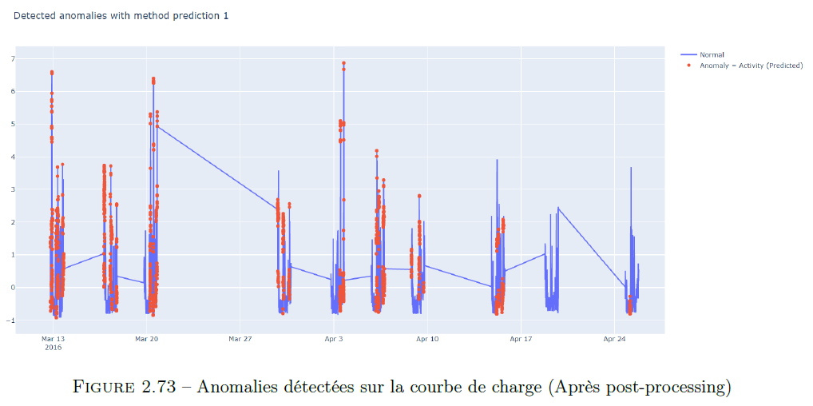
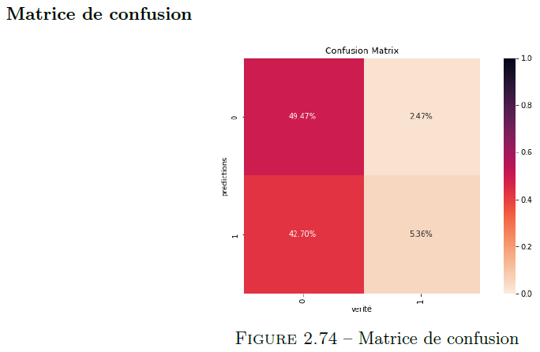
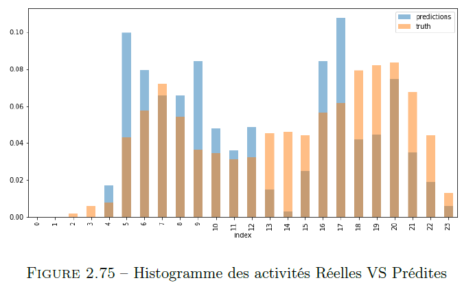
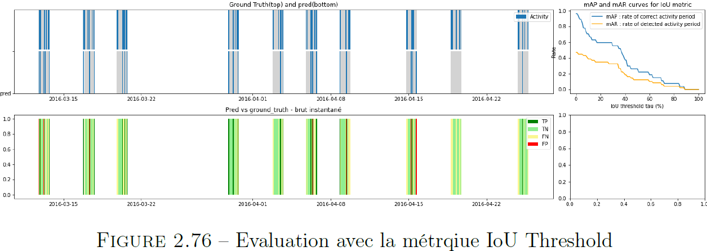

# Projet Fil Rouge (Télécom Paris)

# Détection d'activité - Analyse d'une courbe de charge

**_Projet fil rouge dans le cadre de la formation à Télécom Paris en lien avec une entreprise du secteur de l'énergie_**

## Contexte

L’identification de la charge peut également jouer un rôle important dans la prédiction future de l’utilisation d’appareils particuliers lorsque le processus de collecte des données
historiques est rendu aussi peu intrusif que possible. Par conséquent, le développement d’outils d’analyse des données est la première étape vers une participation active des utilisateurs au développement futur des réseaux intelligents et des services associés. Sans aucun doute, l’analyse des données des compteurs intelligents offre de nouvelles possibilités aux consommateurs et aux entreprises de services publics pour la mise en place d’un réseau intelligent. Toutefois, à l’heure actuelle, les compteurs d’électricité intelligents ne fournissent que des données sur l’ensemble du logement. Cela signifie qu’il est nécessaire
de séparer et d’identifier à partir de la charge totale la consommation électrique de chaque appareil.

## Motivations

Le développement des compteurs intelligents tels que Linky, qui équipe désormais près de 35 mil-
lions de foyers en France (chiffres Enedis 2021), ouvre les champs des possibilités dans le domaine de la détection d’activité. En effet, malgré le grand nombre de scénarios d’application potentiels, la détection de l’occupation des bâtiments reste un processus lourd, sujets aux erreurs et coûteux. L’occupation est généralement détectée à l’aide de dispositifs spécialisé tels que des capteurs infrarouges passifs, des interrupteurs magnétiques ou des caméras. Ces capteurs doivent être achetés, installés, calibrés, alimentés et entretenus. Cela pose un certain nombre de contraintes critiques, en particulier dans les environnements domestiques. Tout d’abord, le coût global de l’infrastructure de détection d’occupation doit rester faible. De plus, les capteurs fonctionnant sur batterie sont souvent utilisés pour éviter le déploiement des câbles d’alimentation. La disponibilité et la fiabilité des capteurs peuvent donc être affectées par des batteries épuisées en attendant d’être remplacées. En outre, dans un environnement domestique, l’un des résidents (souvent inexpérimenté sur le plan technique) joue le rôle d’administrateur du bâtiment qui installe et entretient le système. Les installations défectueuses et le manque de maintenance sont des conséquences fréquentes. L’ensemble de ces contraintes peut rendre des systèmes de détection d’occupation peu fiables et induire des comportements défectueux dans les systèmes domotiques qui en dépendent. Cela peut à son tour causer des désagréments aux résidents et entraver leur acceptation des systèmes.

Par ailleurs, au-delà des contraintes posées par ces types de dispositifs (lourde maintenance, coût élevé, installation défectueuse, . . .) au sein d’un environnement domestique, il s’avère que ces derniers sont des solutions intrusives pas forcément acceptées par le public. Cela constitue alors la principale motivation de l’introduction de nouvelles technologies non intrusives à partir des courbes de charge de consommation électrique. Les méthodes non intrusives offrent une alternative intéressante, avec un coût d’installation très réduit. Les compteurs intelligents sont l’une des unités fondamentales des réseaux intelligents, car de nombreuses autres applications dépendent de la disponibilité d’informations à granularité fine sur la consommation et la production d’énergie. 

## Enjeux

Le sujet de la détection d'activité est un sujet porté par de nombreux acteurs économiques et qui peut être source de nombreux services aux usagers.

Notamment :
* Sécurisation des logements notamment les logements secondaires ou les logements mis en location temporaire
* Prolonger l'autonomie des seniors en leur permettant un maintient à domicile, en alertant les proches ou le personnel médical en cas d’absence anormal d’activité
* Détection de l’heure du retour de l’école des enfants

Les solutions actuelles sont des solutions intrusives, pas forcément acceptées ni simples à installer: par exemple via l'installation de différent type de capteurs qui vont monitorer la présence des habitants etc...

## Objectif

Travailler sur les technologies **non-intrusives** de détection d'activité à partir des courbes de charge de consommation électrique

## Formulation de la problématique

Typiquement, on peut distinguer trois catégories de consommation:

* Consommation de tous les appareils en veille

* Consommation des équipements qui se déclenchent et s'éteignent seuls (type frigo, ballon d'eau chaude... etc

* Consommation des équipements déclenchés par l'utilisateur

Seule cette dernière catégorie d'équipement permet de détecter une réelle activité dans le logement.

L'objectif est donc de concevoir des algorithmes de Machine Learning qui vont permettre de faire une **classification binaire** prédisant l'activité du logement, avec la contrainte de pouvoir s'adapter à différent types de logements pour lesquels on n'a pas de données labelisées (unsupervised learning)

**_Exemple d'une courbe de charge labellisée_**

## Technologie NILM (Non Intrusive Load Monitoring)

L’idée de la reconnaissance d’activité a été étudiée en premier lieu dans le domaine de la santé pour détecter les situations d’urgence en surveillant les activités et les mouvements quotidiens des patients.
Mais ces techniques de reconnaissance reposent souvent sur des capteurs supplémentaires et sont donc intrusives et peuvent être coûteuses. Le NILM comprend un ensemble de techniques pour la surveillance non intrusive de la charge. Son but est de déterminer les changements de tension et de courant entrant dans une maison et de déduire quels appareils sont utilisés dans la maison.

La détection d'activité s’appuie sur la détection d’événements, par exemple, l’allumage et l’arrêt d’appareils et le changement de mode ou d’état de fonctionnement des appareils. Cela suppose alors que la variation de la charge est causée par un seul appareil or cela n’est pas toujours le cas en pratique

## Architecture d'un système NILM

L’architecture du processus d’identification de la courbe de charge de chaque appareil électronique à partir de la courbe de charge totale du domicile se présente comme suit :

Dans une architecture NILM, les interactions entre les habitants, les consommations électriques de chaque appareil et le réseau électriques sont centralisée en un point de convergence. Ce point de convergence est la compteur intelligent. Un classifieur est directement intégré dans le compteur intelligent. Ce dernier est entraîné avec les données collectées pour chaque appareil par le compteur intelligent afin de prédire s’il y a activité ou non au sein d’un foyer à partir de la courbe de charge agrégée.

## Les approches

- Approche supervisée : ``Time2Vec`` et ``Boosting Classifier``
- Approche non supervisée : ``Auto-Encodeur Convolutionnel``

## La pipeline

## Data

* Dataset Open Source de courbe de charge labellisées

###  RAE: The Rainforest Automation Energy Dataset 

Les données utilisées dans un premier temps sont celles provenant du papier RAE: The Rainforest
Automation Energy Dataset (Makonin & Stephen, 2017). Le jeu de données comprend des relevés de
puissances échantillonnés à 1 Hz sur deux maisons à Vancouver sur une durée de respectivement 72
jours (découpée en deux périodes de 9 puis 53 jours) et 59 jours. La première maison est équipées de 24 sous-compteurs (un par disjoncteur) et est habitée par 3 occupants au niveau supérieur et 1 occupant au niveau inférieur.

La deuxième maison est équipée de 21 sous-compteurs et est occupée par 3 occupants. Chaque sous-
compteur a été étiqueté pour pouvoir facilement identifier la source de consommation. Du fait que les deux maisons soient situées au Canada, certains gros équipements sont répartis sur deux sous-compteurs.

Afin de n’avoir qu’une mesure de puissance par équipement les sous-compteurs ont été regroupés dans la suite de l’étude.

On peut observer le graphique circulaire de la répartition du pourcentage des puissances sur la
puissance totale consommées dans les deux maison. Dans la maison 2 nous avons retiré le compteur étiqueté ’House Sub-Panel’ qui correspond à la courbe de puissance agrégée sur tous les sous-compteurs.
On constate que dans la maison 1 la plus grosse consommation provient des sous-compteurs ’Rental
Suite Sub-Panel’. Il s’agit d’un compteur pour le niveau inférieur complet (occupé par une personne), c’est-à-dire une courbe de puissance déjà agrégée.

###  UK-DALE

Notre jeu de données présente deux maisons, ce qui nous a permis de tester nos approches et d’essayer de voir si nos modèlent se généralisent bien d’une maison à une autre. Pour aller plus loin il serait cependant intéressant d’avoir un jeu de données indépendant pour tester nos modèles sur d’autres scénarios.

Pour cela nous avons utilisé le je de données provenant du papier The UK-DALE dataset, domestic
appliance-level electricity demand and whole-house demand from five UK homes (Jack Kelly, 2015). Ce jeu de données est très riche puisqu’il comprend des relevés de puissances échantillonnés à 6 Hz sur cinq maisons au Royaume-Unis sur des durées allant de 39 à 234 jours. Chaque maison est découpée en plusieurs sous-compteurs qui correspondent tous à un appareil électrique. Les appareils électriques ne sont pas tous relevés mais chaque maison dispose du relevé total agrégé sur tout le logement.
Nous avons fait le choix de labelliser la maison 2 de ce jeu de données car c’est la maison qui présente des relevés de mesure sur la plus grande période de temps (234 jours au total, 142 jours après réconciliation de toutes les mesures et nettoyage) et avec un bon niveau de détail au niveau des appareils électriques dont la puissance est mesurée.

On peut également observer le graphique circulaire de la répartition du pourcentage des puissances sur la puissance totale consommées ce logement.

## Métrique d'évaluation

* Accuracy
* Recall
* F-Score
* IoU threshold

### Results

#### Anomalies détectées sur la courbe de charge (Après post-processing)

#### Matrice de confusion

#### Histogramme des activités Réelles VS Prédites

#### Evaluation avec la métrqiue IoU Threshold

